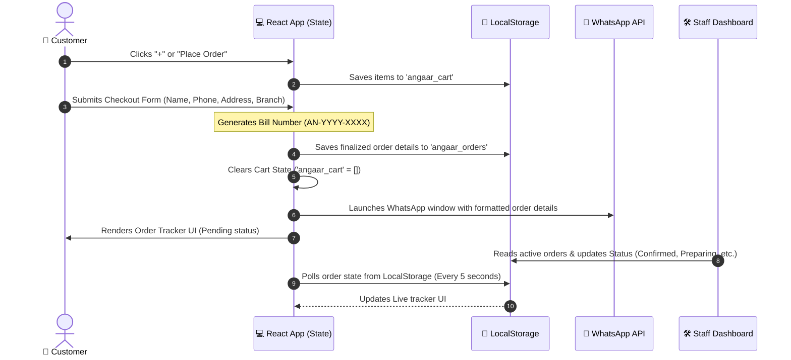
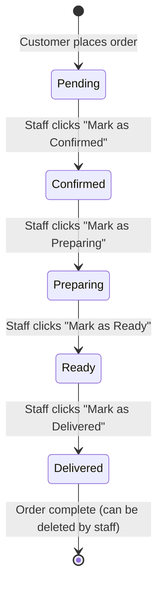
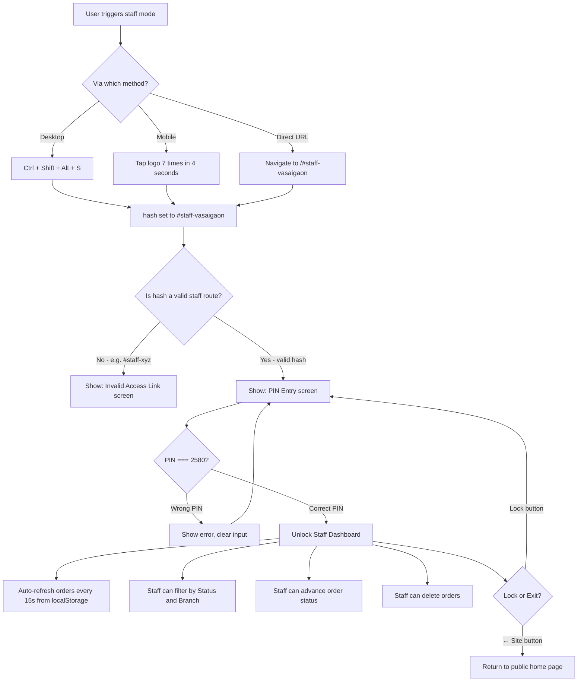
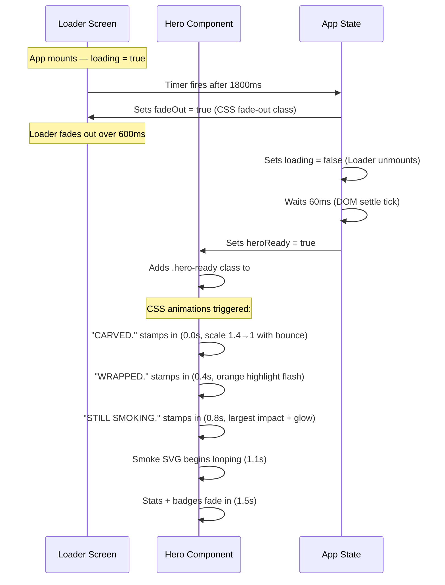

# 🔥 Angaar Shawarma — Phase 1 Application Documentation

Welcome to the documentation for the **Angaar Shawarma** web application. This document provides a complete guide to how the system works, the structure of the codebase, key navigational redirection rules, and the complete data flow.

---

## 🗺️ System Navigation & Routing Flow

The application functions as a single-page application (SPA) controlled by React state (`activeView`). Below is a map of where buttons redirect and how navigation transitions work.

```mermaid
graph TD
    %% Define views
    Home[Home View]
    Order[Order / Checkout View]
    Reviews[All Reviews View]
    Staff[Staff Dashboard View]
    
    %% Navigation triggers
    LogoTaps[Logo 7 Taps within 4s] -->|Triggers staff mode| Staff
    Shortcut[Ctrl + Shift + Alt + S] -->|Triggers staff mode| Staff
    
    %% Nav Buttons
    HomeNav[Nav: Home / Logo] -->|Scrolls to Top / Sets view| Home
    ReviewsNav[Nav: Reviews] -->|Sets view| Reviews
    MenuNav[Nav: Menu] -->|Smooth Scroll| MenuSection[Home: Menu Section]
    BranchesNav[Nav: Branches] -->|Smooth Scroll| BranchesSection[Home: Branches Section]
    
    %% Order / Cart Interactions
    OrderNow[Nav: Order Now / Hero CTA] -->|If Cart Empty| MenuSection
    OrderNow -->|If Cart has Items| Order
    
    %% Actions
    PlaceOrderBtn[Menu: Place Order] -->|Adds item & redirects| Order
    PlusBtn[Menu: + Quick Add] -->|Adds item, stays on menu| MenuSection
    
    %% Checkout Form Actions
    SubmitOrder[Order Tab: Place Order] -->|Saves Order & Clears Cart| OrderTracker[Order Tab: Order Tracker]
    SubmitOrder -->|Opens| WhatsAppLink[WhatsApp API Redirect]
    
    %% Order Tracker Actions
    TrackerReceipt[Order Tracker: View Receipt] -->|Opens Modal| ThermalReceipt[Thermal Receipt Modal]
    DownloadReceipt[Receipt Modal: Download Receipt] -->|Downloads PNG image| DeviceStorage[Local Download Folder]
    PlaceAnother[Order Tracker: Place Another] -->|Resets active tracking| Home
```



---

## ⚡ Data Flow Architecture

The data flows from static configuration files, updates React state, persists in browser storage, sends to external APIs (WhatsApp), and dynamically parses on the Staff Management console.



---

## 📁 Project Directory Structure

Here is a breakdown of the codebase files and their structural roles:

```text
phase 1/
│
├── public/                 # Static assets served directly (icons, favicon)
├── src/
│   ├── assets/             # Images and local media (logos, food graphics)
│   │
│   ├── components/         # Modular UI Components
│   │   ├── Bestsellers.jsx  # Highlighting key recommended menu items
│   │   ├── DeliveryBanner.jsx# Bottom dynamic promotional banner
│   │   ├── FinalCta.jsx    # Action section prompting users to order online
│   │   ├── Footer.jsx      # Left-aligned responsive footer with branch details
│   │   ├── Hero.jsx        # Premium opening section with animation & smoke effects
│   │   ├── Loader.jsx      # Loading screen with spinning brand identity ring
│   │   ├── Location.jsx    # Displays local branch outlets, phone numbers, and maps
│   │   ├── Menu.jsx        # Categories list & inner-floating responsive item info card
│   │   ├── Nav.jsx         # Sticky header with scrolled-pill layout & cart tracker
│   │   ├── OrderTab.jsx    # Active checkout panel, receipt engine & live tracker
│   │   ├── ReviewsBoard.jsx# Corkboard style reviews wall with sticky notes
│   │   └── StaffTab.jsx    # Management panel with code access to alter order stages
│   │
│   ├── utils/
│   │   └── menuData.js     # Master database of menu categories, prices, ingredients
│   │
│   ├── App.jsx             # Main controller logic, routing views & cart states
│   ├── index.css           # Global typography, dark system colors & animations
│   └── main.jsx            # React root mount controller
│
├── package.json            # Application configuration & script registry
└── README.md               # Codebase documentation (this file)
```

---

## 📖 Component Responsibilities & Behaviors

### 1. `App.jsx` (Core Controller)
- **State Management**:
  - `cart`: Persisted in `localStorage` under `angaar_cart`.
  - `activeView`: Decides which screen is currently rendered (`'home'`, `'order'`, `'reviews'`, or `'staff'`).
  - `activeToast`: Controls temporary UI pop-ups when items are added.
- **Routing Rules**:
  - Prevents opening the `order` screen if the cart is empty, instead routing users smoothly back to the `#menu` view.

### 2. `Nav.jsx` (Header & Navigation)
- **Adaptive Layout**: Transitions from a full-width header to a floating glassmorphism pill when the user scrolls down (`nav.scrolled`).
- **🔐 Secret Staff Access**:
  - **Mobile/Tablet**: Rapidly tapping the *logo* 7 times within 4 seconds triggers staff management mode.
  - **Desktop**: Pressing `Ctrl + Shift + Alt + S` triggers staff management mode.
- **Dynamic Badge**: Displays current item quantity inside the cart. If empty, the "Order Now" button triggers a smooth scroll to the Menu section.

### 3. `Hero.jsx` (Landing Section)
- **Watermark**: Renders a large watermark watermark background `ANGAAR` behind elements with an opacity of `0.02`.
- **Text Stamp Animation**: A progressive scale animation (`z-thrust`) slams each headline block onto the screen sequentially:
  1. `CARVED.` (Scale 1.4 -> drops -> bounces)
  2. `WRAPPED.` (Drops with bright orange glow highlight)
  3. `STILL SMOKING.` (Largest scale drop, followed by subtle looping rising smoke SVG animation)
- **Responsive Order**: On mobile devices, the elements stack as: Text content -> Shawarma Image -> CTA buttons -> Stats list.

### 4. `Menu.jsx` (Browse Feed)
- **Selection Card**: Selecting an item opens a detailed product specification showing description, nutrition metrics (Protein, Calories, Carbs), and ingredients.
- **Responsive Insertion**:
  - **Desktop**: The card displays on the right side of the split column layout.
  - **Mobile/Tablet**: The card dynamically renders **immediately above the selected menu row**, providing context-focused UX without clutter.

### 5. `OrderTab.jsx` (Checkout & Progress)
- **Checkout Processing**: Users fill in delivery details or choose takeaway. Clicking "Place Order" formats a clean WhatsApp message and triggers WhatsApp Web/App redirecting to `+91 87666 84117`.
- **Order Tracker**: Once submitted, it renders a real-time status tracker (Pending, Confirmed, Preparing, Ready, Delivered). The tracker reads status updates from `localStorage` in real time.
- **Thermal Receipt (Miniaturized)**: Users can load a virtual thermal receipt paper.
- **📸 Dynamic Receipt Downloader**:
  - Instead of printing, clicking **"Download Receipt"** dynamically injects the `html2canvas` library from a CDN to render the receipt container as a high-quality `.png` image. It triggers an automatic browser file download instantly.

### 6. `StaffTab.jsx` (Kitchen Console)
- **Access Control**: Validates branch location from hash (e.g., `#staff-vasaigaon`) and locks access behind a secure staff PIN (`2580`).
- **Kitchen Actions**: Lets staff view incoming orders, check client details, print invoices, and update status stages, which updates the customer's tracker screen.

---

## 🎨 Global Design System & Variables

The app is built on a custom premium dark charcoal theme defined inside `index.css`:

- **Primary Background**: `#0d0b09` (Charcoal base)
- **Secondary Background**: `#161210` (Ash shade)
- **Card Fill**: `#1f1a16` (Deep charcoal clay)
- **Accent Ember**: `#ff4500` (Ember orange)
- **Accent Gold**: `#ffb74d` (Warm honey flame)
- **Text Bone**: `#f3ead9` (Off-white bone)
- **Smoke Muted**: `#9c9388` (Warm grey)

---

## 🔘 Every Button — What It Does

A complete map of all interactive buttons in the application:

| Button Label | Location | Action |
|---|---|---|
| Logo / "SHAWARMA" | Navbar | Scroll to top (home view). Also increments secret tap counter |
| Home | Navbar → nav-links | Scroll to hero top |
| Reviews | Navbar → nav-links | Switch `activeView` to `'reviews'` |
| Menu | Navbar → nav-links | Smooth scroll to `#menu` section |
| Branches | Navbar → nav-links | Smooth scroll to `#location` section |
| Order Now | Navbar (right) | If cart empty → scroll to menu; Else → switch to `order` view |
| Order Now / View Order | Hero section CTA | Same as Order Now above |
| `+` Quick Add | Menu item row | Adds item (qty 1) to cart, shows toast; Does NOT redirect |
| Place Order | Menu detail card | Adds item to cart AND redirects to checkout (`order` view) |
| Order Now / View Order | Bestsellers card | Same as Hero CTA |
| Order Online Now | FinalCta section | Same as navbar Order Now |
| Browse Our Menu | Empty order screen | Returns to home view and scrolls to menu |
| ← Add More Items | OrderTab cart panel | Calls `goToMenu()` → switches back to home |
| Clear All | OrderTab cart panel | Empties entire cart (`clearCart()`) |
| `-` (qty) | Cart item row | Decrements item qty; if reaches 0, removes item from cart |
| `+` (qty) | Cart item row | Increments item quantity |
| `×` Remove | Cart item row | Removes that specific item from cart |
| Place Order 🔥 | Checkout form submit | Validates form → saves order → opens WhatsApp → shows Tracker |
| + Place Another Order | Order Tracker | Resets `placedOrderId` to null and calls `goToMenu()` |
| View Receipt 🧾 | Order Tracker | Opens thermal receipt modal (`setShowReceipt(true)`) |
| `×` Close | Receipt modal | Closes the receipt modal |
| Download Receipt | Receipt modal | Loads html2canvas via CDN, converts receipt to PNG, downloads |
| ← Back to Site | Staff PIN screen | Calls `onExit()` → switches `activeView` to `'home'` |
| Unlock Dashboard → | Staff PIN form | Validates 4-digit PIN (2580); shows error or unlocks dashboard |
| Refresh | Staff Dashboard header | Re-reads all orders from `localStorage`, updates lastRefresh time |
| Lock | Staff Dashboard header | Re-locks the dashboard (requires PIN re-entry) |
| ← Site | Staff Dashboard header | Returns to public home page |
| Mark as [Status] | Staff order card | Advances order to next status pipeline step; updates `localStorage` |
| 🗑️ (Trash) | Staff order card | Permanently deletes that order from `localStorage` |
| Clear Delivered (N) | Staff controls row | Removes all orders in `Delivered` state from `localStorage` |
| Status Filter Chips | Staff stats bar | Toggles status filter; clicking current active chip resets to "All" |

---

## 🏪 Complete Menu Catalog

All items are stored in `src/utils/menuData.js` and organised into 4 categories:

### Shawarmas (11 items) — ₹100–₹140

| ID | Name | Price | Spicy | Bestseller |
|---|---|---|---|---|
| 1 | Chicken Shawarma | ₹100 | — | ✅ |
| 2 | Tandoori Chicken Shawarma | ₹120 | 🌶️ | ✅ |
| 3 | Peri Peri Chicken Shawarma | ₹120 | 🌶️ | — |
| 4 | Schezwan Chicken Shawarma | ₹120 | 🌶️ | — |
| 5 | Cheese Chicken Shawarma | ₹120 | — | ✅ |
| 6 | Chipotle Cheese Shawarma | ₹120 | — | — |
| 7 | BBQ Chicken Shawarma | ₹120 | — | — |
| 8 | Afgani Chicken Shawarma | ₹140 | — | — |
| 9 | Mexican Chicken Shawarma | ₹140 | 🌶️ | — |
| 10 | Angaar Spl. Shawarma | ₹140 | 🌶️ | ✅ |
| 11 | Chicken Overload Shawarma | ₹140 | — | — |

### Platters (6 items) — ₹250 each

Signature Chicken, Peri Peri, BBQ, Chipotle Cheese, Schezwan, Tandoori

### Salads (6 items) — ₹150–₹170

Roasted Chicken, Tandoori Chicken, Peri Peri, BBQ, Chipotle Cheese, High Protein (Bestseller)

### Mocktails (3 items) — ₹60–₹80

Mint Mojito (Bestseller), Blue Lagoon Mojito, Watermelon Mojito

---

## 💾 LocalStorage Schema

The app uses browser `localStorage` as a lightweight backend. Here is the exact shape of each key:

### `angaar_cart` — Active Shopping Cart

```json
[
  {
    "id": 1,
    "name": "Chicken Shawarma",
    "emoji": "🌯",
    "price": "₹100",
    "desc": "Classic grilled chicken roll",
    "img": "https://...",
    "ingredients": ["Grilled Chicken", "..."],
    "protein": "24g",
    "calories": "380 kcal",
    "carbs": "32g",
    "isBestseller": true,
    "quantity": 2
  }
]
```

### `angaar_orders` — Placed Order History

```json
[
  {
    "id": "1719564800000-abc123",
    "billNo": "AN-2026-4782",
    "branch": "Vasai Gaon Outlet (Main Branch)",
    "orderType": "Delivery",
    "items": [
      {
        "name": "Chicken Shawarma",
        "emoji": "🌯",
        "quantity": 2,
        "price": 100,
        "lineTotal": 200
      }
    ],
    "subtotal": 200,
    "deliveryCharge": 30,
    "grandTotal": 230,
    "customerName": "Aryan",
    "customerPhone": "9876543210",
    "address": "Flat 4, Sunrise Building, Vasai",
    "status": "Pending",
    "createdAt": "2026-06-28T08:20:00.000Z",
    "updatedAt": "2026-06-28T08:20:00.000Z"
  }
]
```

> **Note:** The Staff Dashboard writes to this same `angaar_orders` key when they advance the status. The customer's Order Tracker polls this key every 5 seconds and re-renders if the status has changed.

---

## 📊 Order Lifecycle State Machine

An order passes through the following pipeline. Only the Staff Dashboard can advance status; it can never be reversed.



---

## 🔐 Staff Access Flow



### Valid Staff Route Hashes

| URL Hash | Branch |
|---|---|
| `#staff-vasaigaon` | Vasai Gaon Outlet (Main Branch) |
| `#staff-vasaiwest` | Vasai West Outlet (Angaar Shawarma 2.0) |
| `#staff-nallasopara` | Nallasopara Outlet |
| `#staff-virar` | Virar Outlet |

---

## 🎬 Loading & Animation Sequence



---

## 🌐 External Integrations

| Service | Purpose | Trigger |
|---|---|---|
| WhatsApp API (`wa.me`) | Sends formatted order to `+91 87666 84117` | On checkout form submission |
| html2canvas CDN | Converts receipt DOM to PNG for download | On "Download Receipt" button click |
| Google Fonts | `Bebas Neue`, `Poppins`, `Inter` typography | Loaded via `<link>` in `index.html` |
| Unsplash | Food photography images for menu items | Referenced directly in `menuData.js` |

---

## 📱 Responsive Behaviour Summary

| Screen | Hero Layout | Menu Detail Card | Navbar |
|---|---|---|---|
| Desktop (>768px) | 2-column grid (text left, image right) | Appears in right column | Full pill links + Order Now |
| Tablet / Large Phone (≤768px) | Single column, stacked via `display: contents` ordering | Injected above the selected item row | Logo + Order Now only |
| Small Phone (≤480px) | Same as tablet with smaller text scale | Same as tablet | Compact Order Now with reduced padding |

**Mobile element order (Hero section):**
1. Eyebrow label (`Vasai–Virar's Own`)
2. Headline (`CARVED. WRAPPED. STILL SMOKING.`)
3. Subtitle
4. Shawarma image
5. CTA buttons
6. Stats row

---

## 🚀 Running Locally

```bash
# Install dependencies
npm install

# Start development server
npm run dev -- --host

# Build for production
npm run build
```

The dev server starts at `http://localhost:5173` with `--host` flag making it accessible on your local network (e.g. from a phone on the same Wi-Fi).
